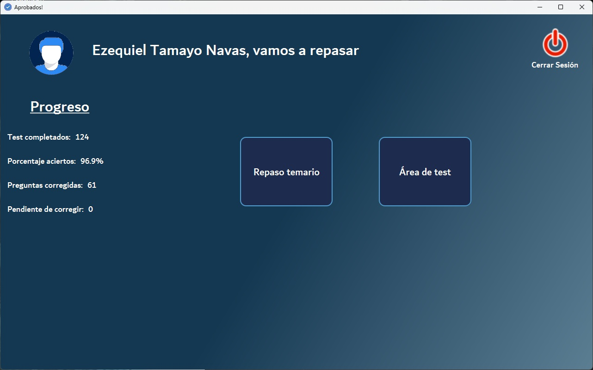
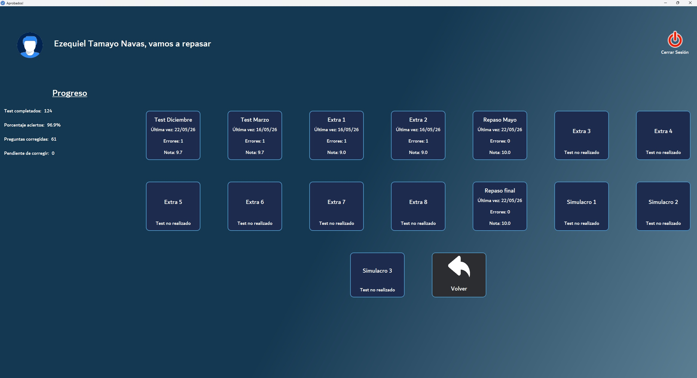
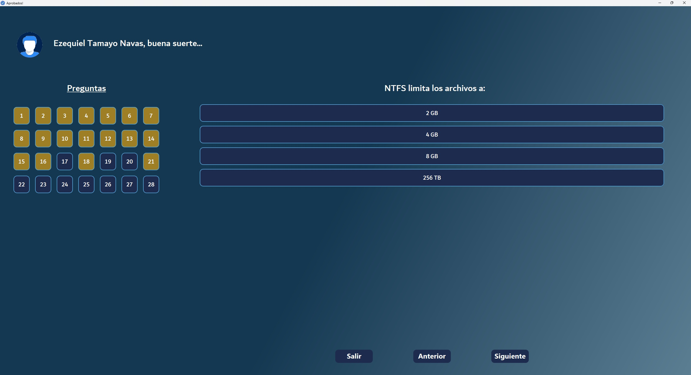
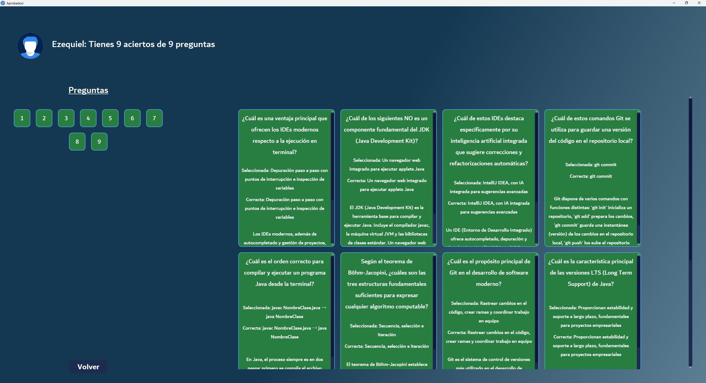
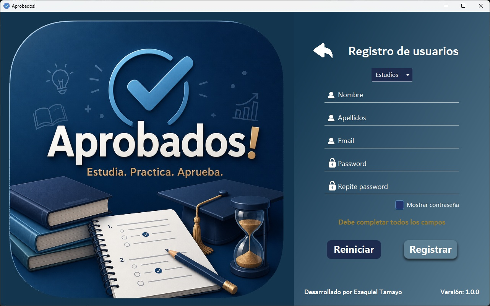
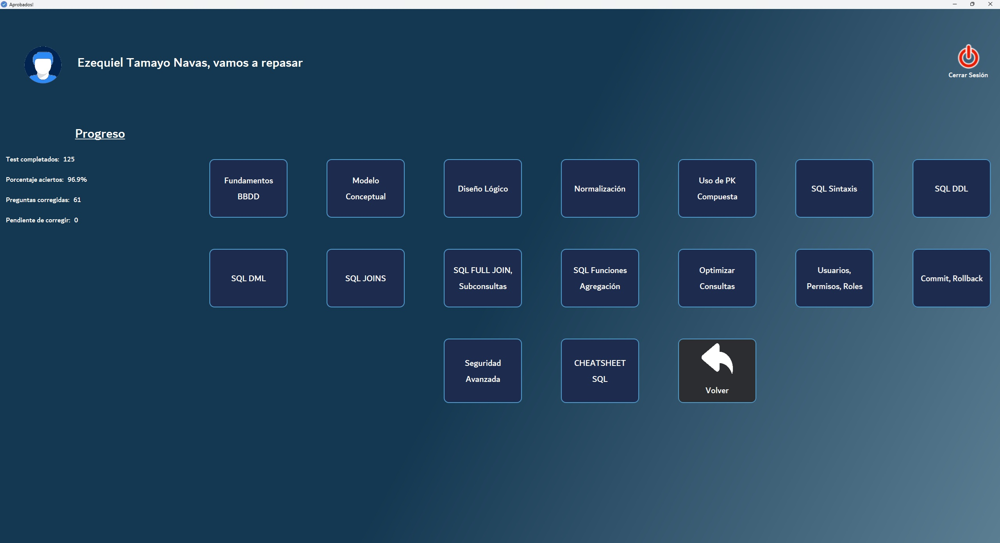

# Aprobados - Plataforma de Estudio y Tests para DAM/DAW

Aplicación de escritorio en Java (JavaFX) para la preparación de exámenes de ciclos formativos (DAM, DAW), con cuentas de usuario, banco de tests por módulo, seguimiento de estadísticas de estudio y repositorio de material docente. Conectada a un backend real en **Supabase**.

---

## Capturas de la Aplicación








---

## Funcionalidades

### Estudiantes
- Registro e inicio de sesión mediante autenticación de **Supabase Auth** (JWT).
- Selección de curso (1º DAM/DAW, 2º DAM) y módulo para acceder a tests o material de estudio.
- Realización de tests con preguntas y respuestas en orden aleatorio (`makeRandomAnswersOrder`, `makeRandomQuestionsOrder`).
- **Repaso de preguntas falladas:** los fallos se guardan y pueden repasarse específicamente en otra sesión.
- **Estadísticas personales:** tests completados, porcentaje de aciertos, preguntas corregidas y pendientes de repasar, calculadas y sincronizadas con el backend.
- Acceso a documentación de estudio (temario oficial y resúmenes) organizada por año y módulo, almacenada en **Supabase Storage**.

### Administradores
- Rol diferenciado (`Role.ADMIN`) con permisos ampliados sobre la gestión de contenidos (tests, módulos, documentos).

---

## Arquitectura y Tecnologías

- **Java + JavaFX:** interfaz gráfica de escritorio con controladores por escena y componentes generados dinámicamente (tarjetas de navegación).
- **Backend as a Service (Supabase):**
  - **Auth:** registro/login mediante los endpoints REST de `auth/v1`, gestionando el `access_token` (JWT) de sesión.
  - **RPC (Remote Procedure Call):** llamadas a funciones de base de datos remotas (`get_perfil_usuario`, `get_estadisticas_usuario`) vía `rest/v1/rpc/`.
  - **Storage:** subida y descarga de documentos de estudio organizados por carpetas (año/módulo/tipo) con URLs públicas.
- **`HttpClient` nativo de Java:** toda la comunicación con Supabase se implementa sin librerías HTTP externas, mediante una clase base `SupabaseClient` con métodos reutilizables (GET, POST JSON, POST binario).
- **Concurrencia con JavaFX `Task`:** todas las llamadas de red se ejecutan en hilos secundarios (`new Thread(task).start()`), manteniendo la interfaz responsiva y actualizando la UI de forma segura mediante los callbacks `setOnSucceeded`/`setOnFailed`.
- **Patrón Factory:** `UserFactory` crea instancias de `Student` o `Admin` según el rol recibido del backend.
- **Herencia y polimorfismo:** `User` como clase abstracta base; `Student` y `Admin` implementan `setRole()` de forma específica.
- **DTOs y Records:** transferencia de datos desacoplada del modelo interno (`UserLoginDto`, `UserSignupDto`, `StudentStatistDto`, `ModuleStudyDto`).
- **Gestión de sesión:** `SessionManager` (Singleton) mantiene el usuario autenticado disponible durante toda la aplicación.
- **Manejo de excepciones personalizado:** `SupabaseConnectionException` centraliza los errores de comunicación con el backend.
- **Lombok:** reducción de código repetitivo en modelos y DTOs (`@Getter`, `@Setter`, `@AllArgsConstructor`).

---

## Modelo de Dominio

| Clase | Responsabilidad |
|---|---|
| `User` (abstracta) / `Student` / `Admin` | Jerarquía de usuarios con rol y datos de perfil |
| `Topic` / `Test` / `Question` / `Answer` | Estructura jerárquica del banco de preguntas por módulo |
| `StudentTest` / `AnswerTest` | Registro histórico de tests realizados por un estudiante y sus respuestas |
| `FileStudy` | Documento de estudio (temario/resumen) asociado a un módulo y curso |
| `UserService` / `StorageService` | Servicios de comunicación con Supabase (Auth, RPC, Storage) |
| `SupabaseClient` | Clase base con la configuración y métodos HTTP reutilizables |

---

## Estructura del Proyecto

```text
src/main/java/org/zeki/aprobados/
├── model/
│   ├── user/       # User, Student, Admin, UserFactory, Role, Study
│   ├── test/        # Topic, Test, Question, Answer
│   ├── syllabus/     # FileStudy
│   └── app/          # Version
├── service/          # SupabaseClient, UserService, StorageService, TopicService
├── dto/               # UserLoginDto, UserSignupDto, StudentStatistDto, ModuleStudyDto
├── controller/scene/  # MainMenuController y demás controladores FXML
├── app/               # SessionManager, AppContext
└── exception/         # SupabaseConnectionException
```

---

## Cómo ejecutar el proyecto

```bash
git clone https://github.com/TamezeDev/Aprobados.git
```

Ábrelo con un IDE compatible con JavaFX (IntelliJ IDEA recomendado). Requiere configurar la URL y clave anónima (`ANON_KEY`) de un proyecto propio de Supabase para conectar con el backend.
Puede descargar la versión actual para escritorio Windows y lanzar directamente el ejecutable desde aquí [Descargar Aprobados-PC](https://drive.google.com/file/d/1D3e0n5hcCW6sZVi4-U_EZVPYB4VtPKNY/view?usp=sharing)

---

## Contexto 
> *Nota:* A diferencia de otros proyectos, `Aprobados` fue usado en producción por mis propios compañeros de clase para prepararse para exámenes reales. Integra un backend real como servicio (Supabase), autenticación JWT, concurrencia en la interfaz y una arquitectura en capas (modelo, servicio, DTO) pensada para escalar.
